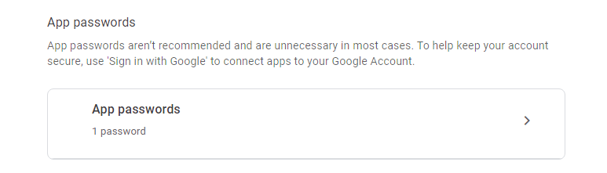

# User Authentication

This is a repository containing the implementation of user authentication when it comes to things such as login, registration and the process of reseting their password.

The code is written in PHP and covers website attacks such as SQL injections and brute forces.

Therefore this is my personal implementation of how I believe user authentication would be best handled. 

```There is always room for improvement, let me know what you would do differently and why.```

LET'S BEGIN!

## Table of Contents

1. [Account Creation](#account-creation)
   - [Email Security Measures](#email-create)
   - [Password Security Measures](#pass-create)
   - [Prepared Statements](#pp1)
   - [CSRF Tokens](#csrf-create)
   - [Email verification](#email-verify)
2. [Login](#login)
   - [Prepared Statements](#pp2)
   - [Failed Login Attempts](#failed-login)
   - [Timed Lockout](#timed-login)
3. [Forgot Password](#forgot-pass)
   - [PHPMailer](#phpmailer)
   - [Input Validation](#input-val)
   - [Rate Limit](#rate-limit)
   - [Token Expiry](#token-expiry)
   - [CAPTCHA Verification](#captcha)

## Account Creation <a name="account-creation"> </a>

Creating an account in any system is an important feature to enable potential users access certain features of your system.

### 1. Email Security Measures <a name="email-create"> </a>
Here I implemented security features that would handle sanitizing and validating user emails in the process of creating an account.

The email was sanitized using the ```filter_var``` function together with ```FILTER_SANITIZE_EMAIL``` filter.

To validate user inputs of the email format together with ensuring that the other fields are not empty, you can refer to the code below:
```php
<?php
  // Validate user inputs
  if(empty($name) || empty($email) || empty($password)){
      echo "Failed to create account";
      exit;
  }
  // Validate email format
  if(!filter_var($email, FILTER_VALIDATE_EMAIL)){
      echo "Invalid email format";
      exit;
  }
?>
```

### 2. Password Security Measures <a name="pass-create"> </a>
The password was then hashed using ```PASSWORD_BCRYPT``` since it includes a unique salt for each password hash making it more secure than md5.

### What's a Salt?

A salt is a random value added to the password before hashing which increases security by making it extremely difficult to crack password using precomputed rainbow tables or dictionary attacks.

Moreover, password strength implementation was done to ensure users choose strong passwords. Things such as password minimum length, combination of uppercase, lowercase letters and numbers were considered.

Simple example:
```php
<?php
  // Validate password strength
  if(strlen($password) < 8){
      echo "Password must be at least 8 characters";
      exit;
  }
    
  if(!preg_match("/[A-Z]/", $password) || !preg_match("/[a-z]/", $password) || !preg_match("/[0-9]/", $password)){
      echo "Password must contain at least one uppercase letter, one lowercase letter, and one number";
      exit;
  }
?>
```
  
### 3. Prepared statements <a name="pp1"> </a>
Prepared statements with parameterized queries are used to prevent SQL injection attacks.

Simple example:
```php
<?php
  $stmt = $conn->prepare("INSERT INTO users (name, email, password) VALUES (?, ?, ?)");
  $stmt->bind_param("sss", $sanitizedName, $sanitizedEmail, $hashedPass);
  $stmt->execute();
  // account creation successful
  $stmt->close();
  return true;
?>  
```

### 4. CSRF Tokens <a name="csrf-create"> </a>
CSRF (Cross-site Request Forgery) protection is implemented by adding a CSRF token to the form and validating it upon submission.

The CSRF token is stored in the session on the server side and upon submission of the form it is compared to the one submitted to ensure the request is legitimate and not a cross-site request forgery.

In the form we include the CSRF token as a hidden input field:
```html
<input type="hidden" name="csrf_token" value="<?php echo $_SESSION['csrf_token']; ?>">
```

Then in the PHP script, a token is generated and once the form is submitted, a new one is generated.

A 32 random byte string is generated using the ```random_bytes(32)``` function and then converted into a 64-character hexadecimal string using the ```bin2hex()``` function. 

This makes up the CSRF token:
```php
<?php
  // Generate a CSRF token and store it in the session
  $csrfToken = bin2hex(random_bytes(32));
  $_SESSION['csrf_token'] = $csrfToken;
?>
```

### 4. Email verification <a name="email-verify"> </a>
I used PHPMailer to implement the verification process.

An email is sent to the potential user's email with a link to verify their email. Once they click on the link, their email is verified and they are able to access the system.

To view details on how to setup PHPMailer, go to [PHPMailer for forgot password](#phpmailer).

Implementation of email verification:
```php
<?php
   // Generate a unique verification token
   $verificationToken = bin2hex(random_bytes(32));

   // store details in database
   $stmt = $conn->prepare("INSERT INTO users (name, email, password, verification_token) VALUES (?, ?, ?, ?)");
   $stmt->bind_param("ssss", $sanitizedName, $sanitizedEmail, $hashedPass, $verificationToken);
   $stmt->execute();
   // account creation successful
   $stmt->close();

   // Send verification email
   $mail = new PHPMailer();
   $mail->isSMTP();
   $mail->Host = 'smtp.gmail.com';
   $mail->SMTPAuth = true;
   $mail->Username = 'elvismutinda2@gmail.com';
   $mail->Password = 'wkhpkegpcgnrtdep';
   $mail->SMTPSecure = 'tls';
   $mail->Port = 587;
   $mail->setFrom('elvismutinda2@gmail.com', 'Elvis');
   $mail->addAddress($this->email, $this->name);
   $mail->isHTML(true);
   $mail->Subject = 'Account Verification';
   $mail->Body = 'Please click the following link to verify your account: <a href="http://localhost/userAuth/private/classes/verify.php?token='.urlencode($verificationToken).'">Verify Account</a>';
        
   if($mail->send()){
      return true;
   }else{
      // If there is an error while sending the email, you can handle it here
      // For example, log the error or display a message to the user
      return false;
   }
?>
```

## Login <a name="login"> </a>

Once a user account is create they can login into the system but we need to have security measure to ensure that the person trying to use the specific account is the owner of that account.

To facilitate this, certian security measures were taken to prevent brute force attacks and sql injections.

### 1. Prepared Statements <a name="pp2"> </a>
This prevents ```SQL injections```. Refer to the [account creation](#pp1) to view the code for this.

### 2. Failed Login Attempts <a name="failed-login"> </a>
Failed login attempts are tracked and stored in the database for each user.

When the count reaches 5 login attempts, the user's account is locked until the situation is resolved.

If the user successfully logs in before the maximum login attempts is reached, the count is reset and they are logged into the system.

This prevents ```Brute force attacks```.

### 3. Timed Lockout <a name="timed-login"> </a>
When the count reaches 5 login attempts, the user's account is locked for 5 minutes and they can't login even with the correct password until the 5 minutes are up.

After the 5 minutes, they can try logging in again with their 5 tries.

## Forgot Password <a name="forgot-pass"> </a>

The process of reseting a user's password in case they forget it needs to be secure to prevent identity theft by hackers.

First we need to setup a library for sending emails in PHP. I recommend ```PHPMailer```
### 1. PHPMailer <a name="phpmailer"> </a>

### Installation
If you have [Composer](https://getcomposer.org) you can run the following line in your terminal to install PHPMailer:

```sh
composer require phpmailer/phpmailer
```

Make sure you're installing it in your development folder.

You can view more details about PHPMailer for installation and use here -> [PHPMailer](https://github.com/PHPMailer/PHPMailer)

After successfully installing phpmailer,we need to first set up our SMTP Server for the mailing process to work:

In my case, I created a ```Google app password``` that will be used to send the reset code emails.

- To create an app password go to your gmail account.

- Navigate to the settings gear icon and click on 'See all settings'.

- Navigate to the 'Forwarding and POP/IMAP' and enable IMAP.
   <p>
      
   </p>
- Once all that is done, click on your user icon in the top right and go to 'Manage your Google Account'.

- On the left navigation bar, click 'Security'.

- Scroll down to 'How you sign in to Google' and click on '2-Step Verification'. You need to have 2-step verification enabled.
   <p>
      
   </p>

- Once there, Scroll down until you see 'App Passwords'.
   <p>
      
   </p>

- Click on the arrow and you should be taken to the registration page.

- Select an app name and device name (these can also be whatever name you wish to give them).
   <p align="center">
      
   </p>
   <p align="center">
      
   </p>
   <p align="center">
      
   </p>

- On clicking generate your app password will be generated. Copy the 16-digit code given and store it safely.
   <p>
      
   </p>
- Now to test if your SMTP server is working, go to [SMTP Test Tool](https://www.gmass.co/smtp-test) and input your details as follows:
   <p>
      
   </p>

- For the 'username' and from 'email address field', input the email address you created your app password with.

- For the 'password' input the 16-digit code generated earlier.

- 'To email address' is just the email address you want to send the test message to.

After all that, get back to coding to connect your SMTP Server to the System.

Implementation:
```php
<?php
   require_once("../../vendor/autoload.php");

   use PHPMailer\PHPMailer\PHPMailer;
   use PHPMailer\PHPMailer\SMTP;

   $mail = new PHPMailer(true);
   $mail->isSMTP();
   $mail->Host = 'smtp.gmail.com';  // Set your SMTP host
   $mail->SMTPAuth = true;
   $mail->Username = 'elvismutinda2@gmail.com';  // Set your email address
   $mail->Password = 'wkhpkegpcgnrtdep';  // Set your email password (app password that is)
   $mail->SMTPSecure = 'tls';
   $mail->Port = 587;
   $mail->setFrom('elvismutinda2@gmail.com', 'Elvis');  // Set the "from" email address and name
   $mail->addAddress($sanitizedEmail);  // Set the recipient email address
   $mail->Subject = 'Password Reset Code';
   $mail->Body = "Your password reset code is: $resetCode";

   if ($mail->send()) {
      return true;
   }else{
      return false;
   }
?>
```

### 2. Input Validation <a name="input-val"> </a>
Email sanitization and validation is done. Refer to [email security measures](#email-create).

Prevents ```SQL Injections / XSS (cross-site scripting) attacks```
```php
<?php
   // Sanitize and validate email
   $sanitizedEmail = filter_var($this->email, FILTER_SANITIZE_EMAIL);
   if (!filter_var($sanitizedEmail, FILTER_VALIDATE_EMAIL)) {
      return false;
   }
?>
```

### 3. Rate Limit <a name="rate-limit"> </a>
This is how many times the user can try resetting their password.

When the rate limit which is 3 is reached, the user can't request for another reset code for the next 24 hours.

This prevents ```Brute force attacks```.

Implementation:
```php
<?php
   private function exceededRateLimit($emailAddress)
   {
      // Check if the email has exceeded the limit of 3 password reset attempts within the past 24 hours
      $conn = $this->dbConnection->conn;
        
      $currentTime = time();
      $limit = 3;
      $timePeriod = 24 * 60 * 60; // 24 hours
      $timeResult = $currentTime - $timePeriod;

      $stmt = $conn->prepare("SELECT COUNT(*) FROM password_reset_attempts WHERE email = ? AND timestamp >= ?");
      $stmt->bind_param("si", $emailAddress, $timeResult);
      $stmt->execute();
      $stmt->bind_result($attemptCount);
      $stmt->fetch();
      stmt->close();

      return $attemptCount >= $limit;
   }
?>
```

### 4. Token Expiry <a name="token-expiry"> </a>
An expiry time for the password reset token is set hence, after a certain period, the token should become invalid, requiring the user to initiate the reset process again.

### 5. CAPTCHA Verification <a name="captcha"> </a>
Here I used Google reCAPTCHA for the CAPTCHA verification to ensure that the request is made by a human and not automated scripts.

To setup the Google reCAPTCHA, we need to go to the [admin console](https://www.google.com/recaptcha/admin/create) and register a new site.

Once that is done, you are given a site key and a secret key.

The site key is used in the html form:
```html
   <script src="https://www.google.com/recaptcha/api.js" async defer></script>

   <div class="g-recaptcha" data-sitekey="your_site_key_here"></div>
```

The secret key is then used in the server-side depending on how you write your code, insert it at the right place.

## NOW LET'S BEGIN THE RESETTING PROCESS!!!
